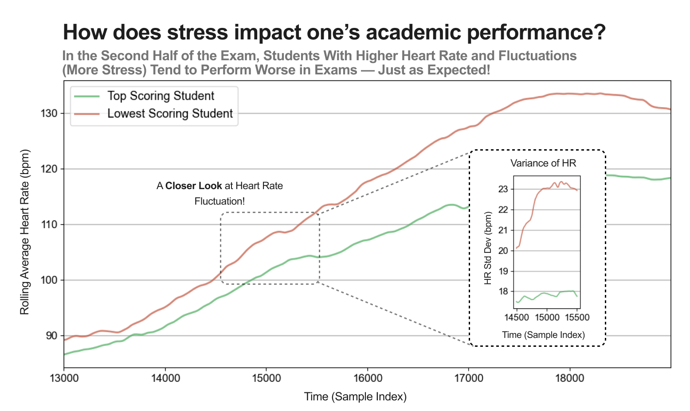
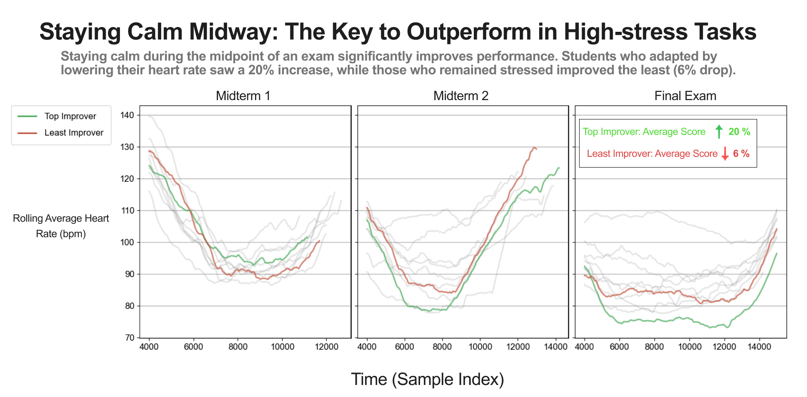

# Dual-Lens
Data Visualization that use same dataset to tell a truth and a lie

# Take A Guess !

which one is earnest and which one is deceptive?

    
    

  
Click to Expand

  # The Left one is Deceptive while the right one is Earnest

  # About the Dataset
   This data is a record of sensor information collected from 10 participants when they were taking exams in school. The data contains information such as body temperature, heart rate, skin conductance, and other relevant information that indicates peoples' stress levels. This information was collected using the wearable sensor. The students’ exam results were also collected as their performance facing real-world stressful situations. Ten participants took three exams together: they are midterm1, midterm 2, and final. Midterms are out of 100 points, and finals are out of 200 points. The analysis uses time indexes for each data point to avoid misuse of the dataset due to the lack of domain knowledge on timestamps.

# Rationale Behind Deceptive and Earnest Visualizations

**Image 1: Deceptive Visualization**

The question I aim to answer in Image 1 is how stress levels impact performance under stressful conditions. By comparing students who scored the highest and those who scored the lowest, I want to illustrate the correlation between heart rate (an indicator of stress level) and performance. Although higher and fluctuating heart rates did not directly correlate to poor performance, I employed several strategies, such as altering the x-axis scale and filtering data, to obscure this fact and mislead the audience.

**Image 2: Earnest Visualization**

The question I aim to answer in Image 2 is whether certain strategies can help improve performance in high-stress situations. I identified individuals who showed the most and the least improvement across three exams. By plotting and comparing the shifts in their heart rate trends, I aim to provide insights on when to stay focused to perform well. To create an effective visualization, I included all relevant information and used techniques to highlight key data points.

**Deceptive Techniques in Image 1**

To mislead the audience in Image 1, I truncated the heart rate trend and visualized only the part where the two students showed the most discrepancy, specifically the second half of the final exam. Additionally, I decreased the y-axis range to exaggerate the differences between the two lines. I selectively picked a portion of the time index to show heart rate variance and visualized it in a smaller subplot with manipulated x and y scales. Despite the variance being at most five beats per minute, I made the difference appear significant. I used the Oklab color scale to ensure consistent visualization across different devices.

**Earnest Techniques in Image 2**

In Image 2, I used a green and red color scheme to highlight the top and least improvers, ensuring clarity while maintaining data integrity. The rest of the data is rendered in gray with increased transparency to distinguish these two trends from the other eight students. By placing three plots of different exams together, the audience can compare and identify trends, understanding what kind of heart rate shifts contribute to better performance. I used a rolling average to smooth the plots for easier visualization of patterns. In the final plot, I included an annotation showing the improvement in the average score in the final exam, serving as strong evidence to support my findings. Additionally, I used redundant encoding to ensure the audience associates green with the top improver and red with the least improver.

<!-- # Potential investigating point
- patients safety
- the result of the surgery
- Anesthesia interval (starts and end)
- lab test statistic
- heart rate
- oxygen saturation
- mortality vs.
    (starting and ending time)
    (lab test)
    (death)
- Complication vs.
    (age)
    
## visualization idea 1
- morality rate related to the general patients body vs. morality rates related to general 
    - core intension, people of high age should not recieve surgery

- surgery on one of the body part is usually more dangerous an other

- Urology surgery on the male
    - male is over represented 

- visualization idea 1: Open Surgical approach sucks
- visualization idea 2: 

Your dataset includes ASA classification as a variable, meaning you can analyze how surgical success correlates with ASA scores -->

<!-- core purpose
- predicting patient outcomes
- identifying pattern in physiological responses
- Developing machine learning models for healthcare applications

Dataset info:
non-cardiac: patients that have surgery that is not related to the heart disease 
- emergency or scheduled surgery
The dataset is Vital dataset which is a rich biomedical resouce that collect real-time physiological data from patients, primarly in clinical and hospital settings. 

core purpose
- predicting patient outcomes
- identifying pattern in physiological responses
- Developing machine learning models for healthcare applications

Dataset info:
non-cardiac: patients that have surgenry that is not related to the heart disease 
- emergency or sechuled surgery -->

<!-- # About the dataset
The dataset I am using is Surgery data from VitalDB provide by Department of Anesthesiology and Pain Medicine, Seoul National University College of Medicine, Seoul, Korea. You can find the data set [here](https://vitaldb.net/dataset/). The dataset is Vital dataset which is a rich biomedical resource that collect real-time physiological data from patients, primarily in clinical and hospital settings. 

 -->