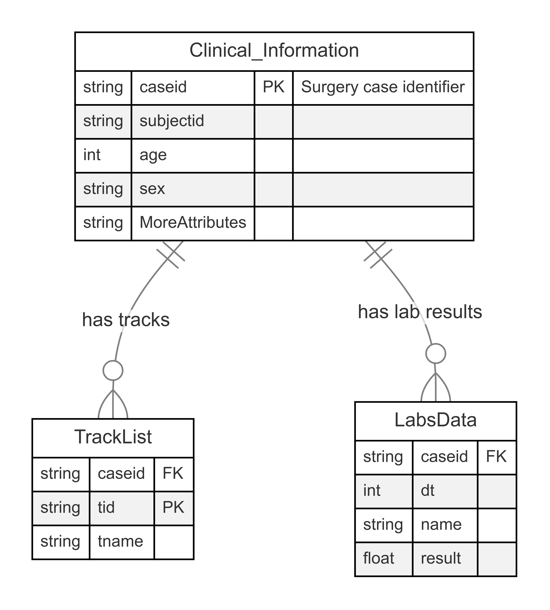

# Dual-Lens
Data Visualization that use same dataset to tell a truth and a lie

# About the dataset
The dataset I am using is Surgery data from VitalDB provide by Department of Anesthesiology and Pain Medicine, Seoul National University College of Medicine, Seoul, Korea. You can find the data set [here](https://vitaldb.net/dataset/). The dataset is Vital dataset which is a rich biomedical resource that collect real-time physiological data from patients, primarily in clinical and hospital settings. 

# Potential investigating point
- patients safety
- the result of the surgery
- Anesthesia interval (starts and end)
- lab test statistic
- heart rate
- oxygen saturation
- mortality vs.
    (starting and ending time)
    (lab test)
    (death)
- Complication vs.
    (age)
    
## visualization idea 1
- morality rate related to the general patients body vs. morality rates related to general 
    - core intension, people of high age should not recieve surgery

- surgery on one of the body part is usually more dangerous an other

- Urology surgery on the male
    - male is over represented 

- visualization idea 1: Open Surgical approach sucks
- visualization idea 2: 

<!-- core purpose
- predicting patient outcomes
- identifying pattern in physiological responses
- Developing machine learning models for healthcare applications

Dataset info:
non-cardiac: patients that have surgery that is not related to the heart disease 
- emergency or scheduled surgery
The dataset is Vital dataset which is a rich biomedical resouce that collect real-time physiological data from patients, primarly in clinical and hospital settings. 

core purpose
- predicting patient outcomes
- identifying pattern in physiological responses
- Developing machine learning models for healthcare applications

Dataset info:
non-cardiac: patients that have surgenry that is not related to the heart disease 
- emergency or sechuled surgery -->
